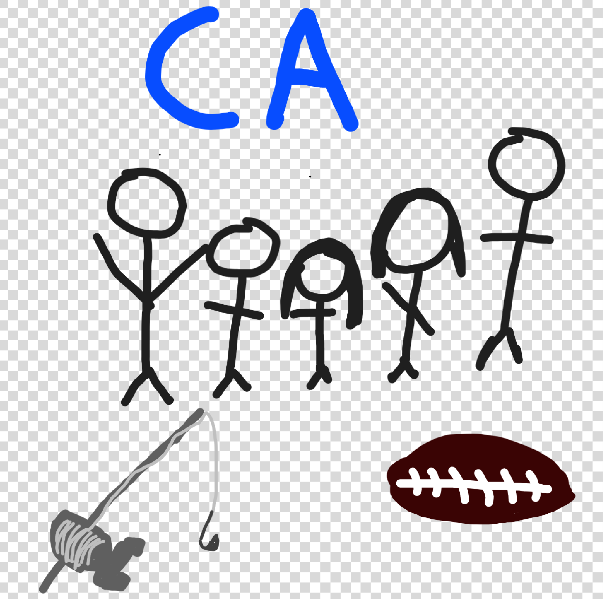

## Marcus Hernandez's Webpage

<h3 style="background-color:DodgerBlue;">Hello, my name is Marcus Hernandez, and this is my Blogpage for AP Computer Science Principles</h3>
## About me
 I am the oldest of 3 siblings, and I have two pets: a bird and a dog.
 I play varsity football, wrestling, and I am plannign to do track this year aswell.
 I love to go fishing and spend time with my friends and family.

<table>
<tr>
<th>Class</th>
<th>Period</th>
</tr>
<tr>
<td>Ethnic Literature</td>
<td>Period 1</td>
</tr>
<tr>
<td>Physics</td>
<td>Period 2</td>
</tr>
<tr>
<td>Ap Calculus</td>
<td>Period 3</td>
</tr>
<tr>
<td>Ap Computer Science Principles</td>
<td>Period 4</td>
</tr>
<tr>
<td>Advanced Football PE</td>
<td>Period 5</td>